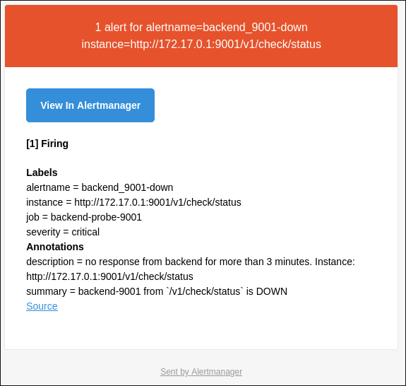

# local container

internal usage for container in linux system environment using docker

> ~/.local/container

 

## info

- monitor:
    - system resource
    - backend resource
    - system warning/error

`resource monitor`

 

`system email notification alert`

 

---

###### end of readme

